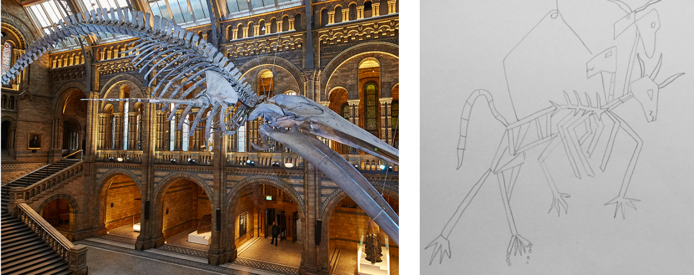
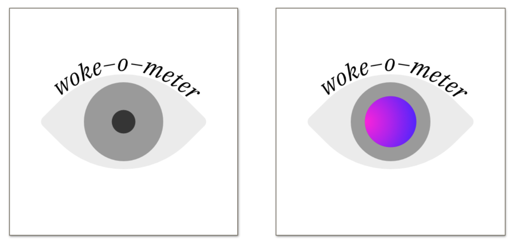
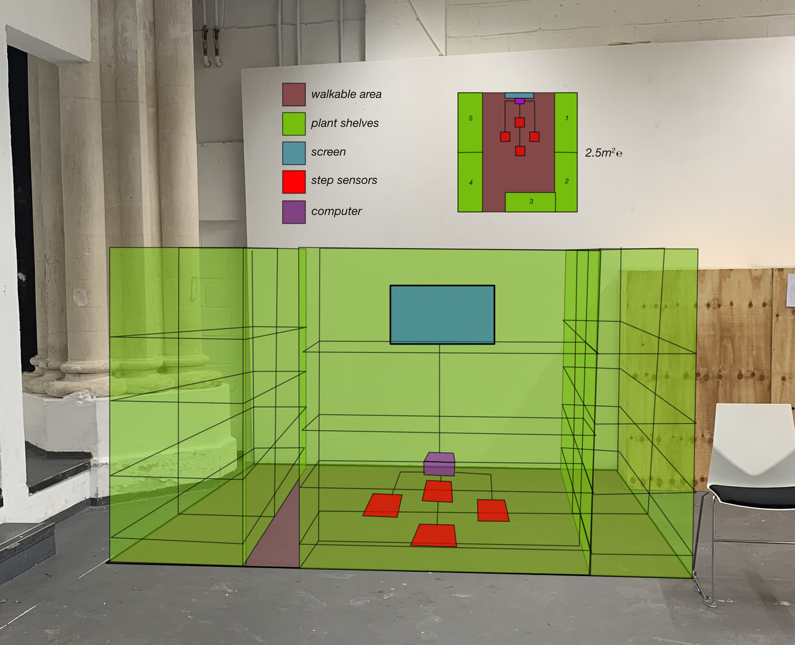
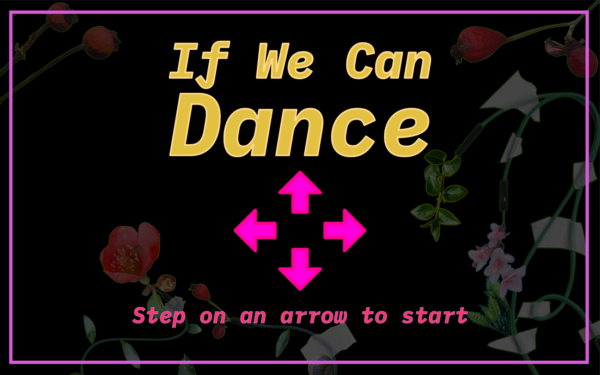
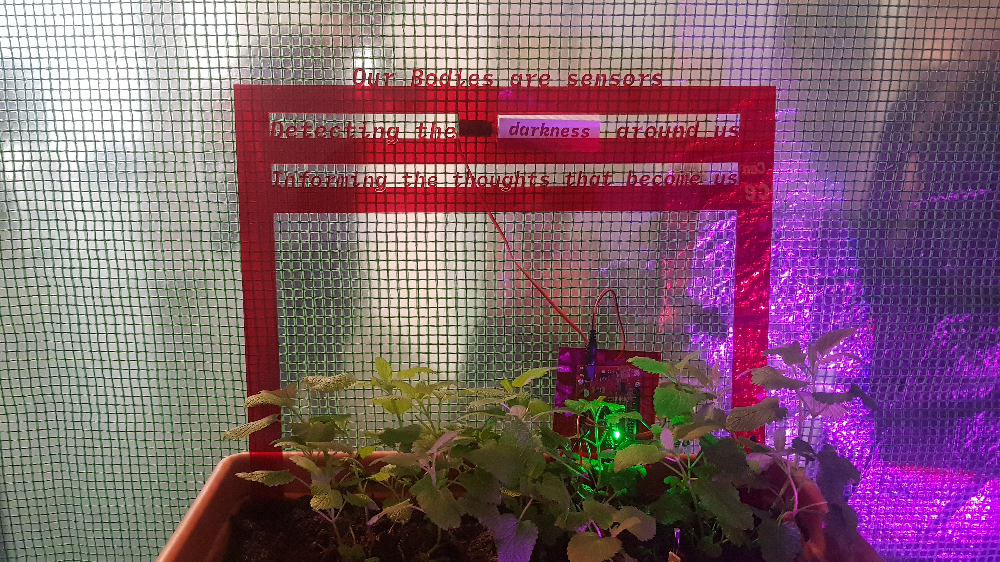
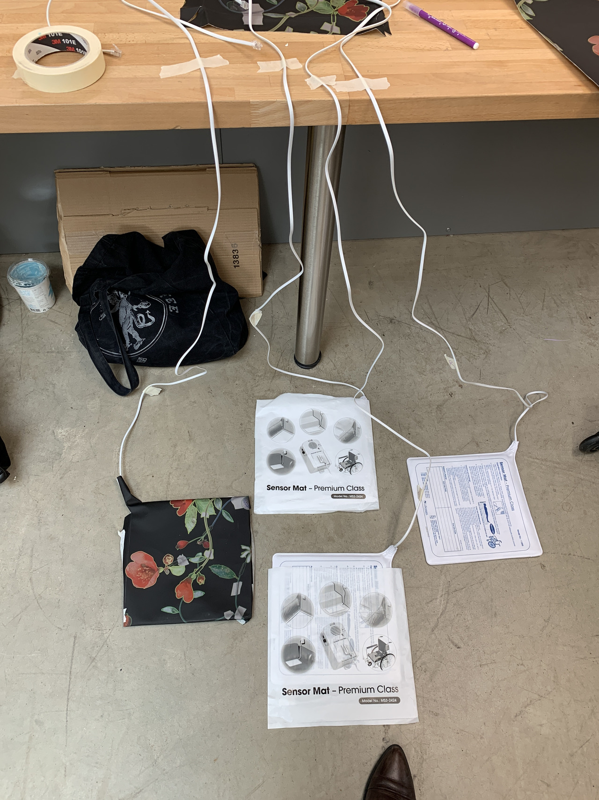

### Final Creative Project:
# If We Can Dance
### Isabella Celeste Maund
### May 2019

\

<nav>
1. [Piece Description](#piece-description)\
2. [Creative Research & Iterations](#creative-research-iterations)\
3. [Design & Process](#design-process)\
4. [Exhibition & Evaluation](#exhibition-evaluation)\
5. [Contribution](#contribution)\
6. [Bibliography](#bibliography)\
Code: *[GitLab Project](https://gitlab.doc.gold.ac.uk/imaun001/dance)*
</nav>

\

---

## Piece Description

*If We Can Dance* explores self-empowerment, empathy, and post-humanism through dance and touch. The piece poses two main questions: how can we use our bodies to feel pleasure? What are our bodies/where do they start and end? Inspired by recent LGBTQIA+ dance protests in response to the increasing presence of extremism and international changes to human rights, the piece explores ideas of self love, intimacy and empathy as a method of resistance, by encouraging the audience to reject the label of human and expand their spacial understanding of self/body.

Situated within a greenhouse, a dance mat and animated graphical interface invite an audience member to engage with a six minute interactive dancing exercise, see figure 1. Inspired by the mechanics of Dance Dance Revolution, the participant is presented with dance moves, represented as left, right, up, and down movements. The music, influenced by techno and electronic dance music, consists of three tracks which gradually become more dense with lyrics. These lyrics act both as instruction and information provider, by guiding the participant through a range of philosophical questions and ideas.

<figure>
<iframe width="560" height="315" src="https://www.youtube-nocookie.com/embed/oGUcBhtqRXQ" frameborder="0" allow="accelerometer; autoplay; encrypted-media; gyroscope; picture-in-picture" allowfullscreen></iframe>
<figcaption>Fig.&nbsp;2 — Film of the project during the exhibition.</figcaption>
</figure>

The first track starts off with a faster tempo, encouraging the participant to connect to the rhythm and move their body to the beat. The second, slower track puts into question the meaning of the word human, and brings forth the idea of freedom through pleasure. The final track introduces ideas around intimacy and touch, and ends with a speech which is a call to action, requesting the participant to reject boundaries that are designed to oppress and exploit those lives we deem as ‘Other’. Finishing on an optimistic note, the final line of the last track states, “So let’s dance — if we can dance”. Evoking the famous Emma Goldman quote, “If I can't dance, I don't want to be part of your revolution.” The title *If We Can Dance* poses a certain optimism, and aims to further energise and empower the participant to seize the power they have to enable themselves to feel happiness, joy, and empathy towards themselves and other lifeforms. See figure 2 above for recordings of the piece in action.

Inside the greenhouse, alongside the dancing experience, there is a poem presented in laser-cut red translucent acrylic. This poem consists of four stanzas, placed in four separate plant pots containing fragrant herbs such as lavender, thyme, mint, and lemon balm. The tone of the poem is determined by the environment within the greenhouse, via key words that change based on sensor data. These sensors measure light levels, temperature, UV, and soil moisture; each of these factors determining whether or not these plants will survive, thrive or wilt. Each sensor is attached to an Arduino, which is then connected to a servo attached to the back of the acrylic. Attached to each servo is a pentagonal prism with words printed across three sides. When the environment in the greenhouse changes, these servos rotate, changing the visible word. There are meaningful connections made between the input data and the word that is revealed, alluding to the well-being of the herbs.

The poem reflects themes that are first introduced in lyrics of the music. Written from the perspective of the herbs, the poem requests the viewer to question what their body is sensing, and asks the participant to touch the leaves of the herbs. By touching the herbs, an oily residue is left on their fingers, provoking the question of where the body of the participant and the plant now start and end. The piece offers self-care, intimacy, and empathy, in exchange for requesting the participant to expand the boundaries they understand of themselves by including other lifeforms in their definition of self.

## Creative Research & Iterations

For my project proposal, I explored creating a piece which investigates veganism and animal rights, in conjunction with different ideologies, social and political belief systems. For this version of the project I created a prototype, in which I collected animal bones from a local butcher, and then went through the laborious process of cleaning these bones. This process is shown below in figure 4. The idea behind this piece was to create an interactive sculpture that represented the enormous size and challenge of tackling these issues, see figure 3 for a sketch of this. However, after creating this initial prototype I realised that this project idea had creative flaws and feasibility issues. I realised that the topics I wanted to explore were both complex and dense, and that to be able to create a piece that approached these topics respectfully and critically I would have to have a very deep understanding of exactly what I wanted to communicate.

<figure>
<iframe width="560" height="315" src="https://www.youtube-nocookie.com/embed/4VdPnQLSKn4" frameborder="0" allow="accelerometer; autoplay; encrypted-media; gyroscope; picture-in-picture" allowfullscreen></iframe>
<figcaption>Fig.&nbsp;4 — Bone Cleaning and Bleaching Process.</figcaption>
</figure>

From this proposal I moved onto my fine art dissertation, in which I explored the intersections of human and animal rights by posing the question, To what extent can an Artwork address animal rights without involving human Rights? I explored this through the works of contemporary animal rights artists such as Sue Coe, Rocky Lewycky, and LA Watson. I proposed that the separation between human and animal was the root of many oppressions, and that the label of human is highly political. I was came to this conclusion through reading the work of Rosi Braidotti in the Posthuman and Marjorie Spiegel's Dreaded Comparison.

Through this research I also noted that it was difficult to find a clear history of animal rights artwork, and that those artists successful in this area were all of White, Western backgrounds. This is perhaps not surprising as statistics presented by the Museum Board Leadership: National Report showed that there are still deep-rooted issues in regards to representation in the Arts (Halperin and Burns, 2018; Museum Board Leadership: A National Report, 2017). Through my investigation, I also found issues with regards to power dynamics and appropriation, where comparisons between human and animal enslavements and exploration were made to push forward a certain agenda. This was particularly noticeable in the piece '(Genocide) Is It Neccesary?' by Rocky Lewycky, in which every day of the exhibition the artist would enter the space and destroy ceramic sculptures of farmed animals. He would then allow the audience to donate money to prevent this from happening, creating a disturbing power dynamic with the piece. Through this research, it was made clear to me that with this piece I was creating, I did not want to push a particular agenda. My goal instead was to put into question how we distinguish between human and animal and how we define these boundaries. Please see [my dissertation](IsabellaMaund_FADissertation_Jan2019-2.pdf) for in depth research on these topics of post-humanism as well as the critical analysis of the aforementioned artists.

A second iteration of the work then followed, in which I began to explore the symbolism of blood and soil in conjunction with farming, access to food, animal rights and human rights. At this point around February, I was struggling with finalising my ideas and coming up with a version of the piece that was not relying on emotional manipulation, and was aware of power dynamics.

This led me to the third iteration of the piece, in which I to explored the social currency involved in labels such as ally, feminist, vegan, activist, etc. This piece intended to explore labour and social labels to challenge what these words really mean and how they have been commodified. However, when creating a prototype for this piece, centred around a questionnaire, I felt that there were significant limitations to what the piece was exploring, and it did not include the topics I had researched around animal liberation and human rights.

<figure>
<iframe width="560" height="315" src="https://www.youtube-nocookie.com/embed/05xCG9Stw3Y" frameborder="0" allow="accelerometer; autoplay; encrypted-media; gyroscope; picture-in-picture" allowfullscreen></iframe>
<figcaption>Fig.&nbsp;6 — Prototype of the questionnaire mechanic.</figcaption>
</figure>

I begun to explore labour in a different form, namely dance. I believed it could be interesting to have participants perform for their “wokeness", satirising the gamification and popular trends of language around social justice, and the commodification of this. However, when creating music for this project I realised that there was something special about the simple connection between body and music, and how the act of dancing was both liberating and energising. Dance is a form of exercise that combines self expression and creativity, and has a strong link to the LGBTQIA+ community (SOURCE). This brought me to the final iteration of the project, known now as *If We Can Dance*, which attempts to offer a more uplifting experience.

At this point I focused on the idea of exploring dance as a method of self empowerment, and by extension a form of protest. Inspired by recent LGBTQIA+ dance protests in response to rising extremism and violence towards the LGBTQIA+ and BME community, I wanted to promote dance as a method of self love, self acceptance, and as a method for accessing serotonin production. I  combined this idea with Dance Dance Revolution's dance mechanism — using a dance mat to guide the participants movement. This was incorporated to help remove the anxiety of dancing, and to provide a distraction from the rest of the exhibition. I felt it was necessary to write my own music tailored to the experience, with lyrics that communicate the ideas explored through my creative research.

<figure>
<iframe width="560" height="315" src="https://www.youtube-nocookie.com/embed/HUGjW9o7Sk0" frameborder="0" allow="accelerometer; autoplay; encrypted-media; gyroscope; picture-in-picture" allowfullscreen></iframe>
<figcaption>Fig.&nbsp;7 — Full audio track from the dancing experience.</figcaption>
</figure>

Through the lyrics I was able to explore human and animal, self expression, and empathy; however I still believed that there was something missing. If the piece consisted of a dancing interaction with music, how would this be presented? I decided it would be important to have the piece in its own secluded space, to remove the element of performance, and to focus on an exploration of the body, self, and ‘Other’. I thought about creating a room dividing effect using herbal fragrant plants to create a feeling of safety, and provide relaxing scents and aesthetics.

<figure>
<iframe width="560" height="315" src="https://www.youtube-nocookie.com/embed/sRu3buMbMw0" frameborder="0" allow="accelerometer; autoplay; encrypted-media; gyroscope; picture-in-picture" allowfullscreen></iframe>
<figcaption>Fig.&nbsp;8 — Mock-ups of the space.</figcaption>
</figure>

At first I wanted to use free-standing shelves of plants to achieve this effect. I made contact with several set dressing and plat hire companies, and learned that this would be prohibitively expensive. Instead of using shelving I was able to find a temporary greenhouse structure that was a good size and shape for enclosing the experience, and would allow me to create privacy in the space. I was encouraged by this but still felt that there was a slight disconnect between the presence of the herbal plants in the space and the dance experience.

One question I wanted to provoke with the piece was “Where do our bodies start and end?” with intent to evoke empathy in the participant, by helping them question the boundaries of themselves and encouraging them to include other lifeforms, such as plants, animals, other humans, in their definition of self.

To do this I aimed to challenge the power dynamics in the piece by making the herbal plants an equal participant in the piece. At first I thought it may be interesting to have sensors detecting the health of the plants so that audience members could have this information translated and nurture the plants. However, this presented another power dynamic where the participant was positioned as the protagonist and saviour, rather than an equal. Therefore I decided it would be interesting instead to write a poem from the perspective of the plants and to have a word in each line of the poem be determined by  sensors. These sensors would translate the environment in the space and transform this information into a form of plant poetry, exploring the self determination of the plants. An achievable approach I found was to have sensors that detect some of the main factors effecting health and well-being of both the plants and the participants in the piece, highlighting their relationship and interconnectedness. The sensors I chose to achieve this were a UV, light, temperature and soil moisture sensor. I then wanted to make meaningful connections between the words that were being determined by these sensors and the input data itself, Please see figure 10 below for some sketches of how I was able to make these connections. With these ideas in mind I had to find a way to materialise them, which led me to the design and creation of the project itself.

## Design & Process

In order to create the dancing experience, I needed a reliable input device that the could be stepped on and detect the users steps. At first I thought about building a dance pad from scratch, however, building a pad reliable enough to last for thousands of steps seemed significantly above my skill set and was not a good use of my time. With some research I came across some pre-made dance mats but was unsure about their reliability. This option would also give me very little control over the final aesthetics of the piece. I was able to speak to the technical assistants and did some research myself, and came across medical sensors for dementia patients. These sensors are simple, reliable, pressure sensors that have been designed to detect whether a patient has gotten out of bed, or stepped out of a room. I luckily was able to find a style of sensor that was a nicely sized square and purchased this to do some testing.

The sensor came with a telephone (RJ-9) connector, as these sensors are designed to connect to an emergency pager. As I know this sensor has been thoroughly tested during manufacturing, I wanted to avoid taking it apart in any way. I decided it would be best to find matching sockets to these and solder these to a breadboard, instead of modifying the wiring. These kinds of plugs are mostly used in old wired land-line telephones. I was able to find an old telephone and take this apart to source some matching sockets. Please see below for more of this process.

<figure>
<iframe width="560" height="315" src="https://www.youtube-nocookie.com/embed/br63mQjWtTo" frameborder="0" allow="accelerometer; autoplay; encrypted-media; gyroscope; picture-in-picture" allowfullscreen></iframe>
<figcaption>Fig.&nbsp;11 — Telephone socket connector construction.</figcaption>
</figure>

These sockets worked well and allowed me to detach and re-attach the sensors easily to my custom built connector. This gave me much needed flexibility when transporting and constructing the rest of the piece.

With the overall aesthetics of the piece, I wanted to embody a futuristic, solar-punk, transparent-technology aesthetic. To do this I took hundreds of pictures of different plants and scanned wires to make collages. This took quite a lot of time and significant learning, as I do not have a strong background in graphic design software. I used Affinity Designer to remove the background of the plants using vector curves, and create these collages. See figure 12 below for a video of how this was done.

<figure>
<iframe width="560" height="315" src="https://www.youtube-nocookie.com/embed/Z-Oh4m-ynWU" frameborder="0" allow="accelerometer; autoplay; encrypted-media; gyroscope; picture-in-picture" allowfullscreen></iframe>
<figcaption>Fig.&nbsp;12 — The process used to create the collage.</figcaption>
</figure>

When building the dance experience I referenced the mechanics of Dance Dance Revolution, leaning on the participant's pre-existing understanding of this interaction, but removing the competitive element. Therefore, when designing the UI of the dance experience, I started with the simple arrows and added an interesting background. I wanted to keep the UI simple as not to distract from the lyrics, music and exercise of the piece. Therefore on top of this I then added the collages I had been working on and added movement to them, to create a dynamic background. To make the dance pads more aesthetically pleasing, and to visually connect them to the UI on the screen, I had custom printed material made. I used the same collages I created for the UI and added used the same arrows on screen to ensure that it was obvious there was a connection between them both. On the screen I also gave an instruction on how to start the interaction, stating that standing on a dance pad would trigger the experience to begin. This further helped clarify the interactions of the piece for the participant.

I also needed to think of how the game was going to reset for a new participant, and wanted to keep this simple to avoid confusion around the interaction in the piece. A significant part of the code is focussed on timings, therefore I thought it would be best to simply detect if there was a lack of interaction for a certain amount of time and to reset when no buttons are pressed. With some testing I learned that 10 seconds was a suitable reset period, as it leaves enough time for a participant to leave the piece and a new participant to enter.

In terms of programming I used SDL, a library commonly used in game creation. Though I was taught OpenFrameworks, I have struggled a lot with getting projects to build and run reliably, so I avoided using it for this project. SDL is used to load the music as one long .wav file, and plays using an audio callback. Images are loaded as .bmp files and displayed in a full-screen window. Parts of the background rotate at different angles generated by putting the current time through the sine wave function with different offsets.
Please see my code here: [https://gitlab.doc.gold.ac.uk/imaun001/dance](https://gitlab.doc.gold.ac.uk/imaun001/dance).

<figure>

<figcaption>Fig.&nbsp;14 — Screen recording of the complete dance experience.</figcaption>
</figure>

The dance pad sensors are connected to an Arduino, which sends a message to the computer via serial any time a pad is pressed or released. The computer reads these serial messages and takes note of the time that the message was received. This is used to check if the participant pressed the pad at the correct time, plus or minus one tenth of a second. This is quite a large time window, as the experience is designed to be enjoyable and never frustrating.

The dance program has a mode that allows for recording dance moves. It does this by writing the timings and directions of each step as they happen into a file. I created steps that were synced to the music by manually stepping out every move while listening to the music as it plays from the program itself. This results in step timings that are synced to the music, and gave me the freedom to design the steps in an intuitive way.

The poem is laser-cut from a sheet of red translucent acrylic. This was done using Affinity Designer to draw a vector outline, and carefully modifying individual points on the text make it suitable for laser cutting. This included connecting the dots of the lower case **i** to its body, thickening any very small joins, and completely re-working the tails of the letters (such as on **j** and **g**). I iterated on this several times, using cardboard and scrap acrylic for testing.

<figure>
<iframe width="560" height="315" src="https://www.youtube-nocookie.com/embed/-XfpCm6PIEU" frameborder="0" allow="accelerometer; autoplay; encrypted-media; gyroscope; picture-in-picture" allowfullscreen></iframe>
<figcaption>Fig.&nbsp;16 — Laser cutting a test into cardboard.</figcaption>
</figure>

The dynamic words in the poem are selected based on environmental sensor values. My first prototype of this used a rotating circle segment with words at different angles. A rectangular overlay was used to show only one word, hiding the rest. This construction was too large to fit in the poem construction, and too heavy to be held up by the servo alone.

In the final version of this mechanism, each of the changing words uses an Arduino, sensor, and servo, and 9V battery. The Arduino reads a value from the sensor, and sets the angle of the servo based on thresholds that I calibrated once the piece was set up in the space. The servos have pentagonal prisms attached to them with words on three of the sides. A pentagonal prism is used as the range of motion of the servos is too limited to put the three words on each side of a triangle prism. This was inspired by an old method of displaying train times on notice boards. I kept additional batteries at hand during the exhibition to swap out as needed, which I had to do twice.

<figure>
<iframe width="560" height="315" src="https://www.youtube-nocookie.com/embed/qDWD9vTMP-w" frameborder="0" allow="accelerometer; autoplay; encrypted-media; gyroscope; picture-in-picture" allowfullscreen></iframe>
<figcaption>Fig.&nbsp;17 — Iterations of the dynamic word mechanism.</figcaption>
</figure>

With the code working and the UI finalised, my material arrived and I was ready to put together the dance squares. At first I thought it would be best to sew little pockets that the sensors could slide into. However, when the material arrived I discovered that it was a lot thicker and stiffer than I originally thought. I did some prototyping to see how they would look by sticking the material down with tape, see fig 18 below.

I then tried the construction with hot glue as this seemed easier and more efficient. Once I measured and cut out the correct size squares I then carefully hot glued the material down onto the squares, taking care to keep the corners sharp and to not damage the sensors themselves. To ensure that they would look good in the space, I first planned which sensor would relate to which direction, and then carefully constructed them. To keep them secure in the space I attached heavy duty Velcro to the underside and then stuck this down to the floor in the exhibition space, giving me the flexibility to adjust the position if needed.

Whilst working on the construction of the piece, I was also working on the more creative components, such as the music and poetry. As I do not have a background in music I was very worried at first about how this would come together. I dedicated a lot of time to experimentation and figured out a process which worked well. I used GarageBand, a MIDI keyboard, and a microphone. I first used the keyboard to play sounds and create the instrumentals of the piece by layering different instruments. I then added vocals on top of this by free styling lyrics to the songs. I would then edit and re-do the vocals once the lyrics were finalised.

## Exhibition & Evaluation

On the day before the exhibition I took part in a promotional video that was created by the communications department (figure 19). This was helpful as it allowed me to practice talking about the piece in a higher pressure setting. The night before the exhibition I was able to finish set-up at a normal hour, and give myself enough time to prepare for the viva voce the following day.

<figure>
<iframe width="560" height="315" src="https://www.youtube-nocookie.com/embed/4VwsUvqVfqU" frameborder="0" allow="accelerometer; autoplay; encrypted-media; gyroscope; picture-in-picture" allowfullscreen></iframe>
<figcaption>Fig.&nbsp;19 — Goldsmiths' promotional video about the piece.</figcaption>
</figure>

The opening of the exhibition went very well and we were able to draw a large audience. The piece gained a lot of attention and even had queues at several points during the evening. I was very satisfied with how people were interacting with the piece and how there was a lot of curiosity around all the different components. I was able to watch as people interacted and saw people giggle and laugh as they danced around to the music. Many guests were interested in discussing the piece with me so I was able to give more background to the different components.

One thing that surprised me was that a few people didn’t realise that there were headphones and music to the piece. The headphones were placed just below the screen, however, I believe that I should have also mentioned this on the start screen of the piece to ensure that they were not ignored. Without the music in the piece it becomes very difficult to follow the steps and to understand the different components of the piece. This is a minor adjustment I would make when exhibiting the piece in the future.

I believe that I pushed myself with this piece, in terms of all of my skill sets. I did a lot of background research and spent a lot of time iterating through ideas to get to a place where I felt the piece was strong. In past exhibitions I struggled with being satisfied with the final piece as I often spent more time constructing it than I did researching and iterating. These iterations gave so much clarity on the purpose of the piece and the aesthetics. With this deep understanding of the goals of the piece, it was able to come together in a relatively short amount of time. I gave myself just under two months for the construction of the piece and this ended up being just enough time. I was very careful with planning out my days, and was entirely focused to ensure that the execution of the piece was to the best of my ability.

I was pleased with how the creative components of the piece came together, such as the music and the collages. I believe that the music in the piece was a very strong feature that really helped translate the ideas I was trying to communicate. Considering I started with little experience in music creation, and was trying to explore lots of complicated ideas, I think I was able to create a piece that touched on the important aspects of these ideas and explored them in a more personal and creative way.

If I was to further iterate on the piece, I would try and explore how to make the plant poetry more readable, as I think that without some more explanation, some participants may have found it difficult to understand the complexities of the ideas I was presenting.

This was the hardest I have ever worked on a piece, so I am very satisfied with the outcome and am proud of what I was able to achieve as my final university piece. I was able to learn so much and ignite so much curiosity within myself. In the future I would like to continue to explore these ideas further, and to create more music. This piece has given me the confidence to be able to do that.

## Contributions

In terms of my contribution to the exhibition organisation I was part of the marketing team and helped coordinate in this role. I did the following:

- Sent out invitations to six-hundred guests.
- Organized for the posters to be displayed on screens across campus.
- Hung up the posters and banner around campus with help from Mishal.
- Participated in creating promotional material for the exhibition in the degree show video.
- Wrote and gave the opening speech of the Exhibition. The presentation was shared with Mishal also.
- Created a feedback form for the exhibition.

## Bibliography
These were the source that I referenced in my dissertation, this write up and my project proposal. Therefore part I haven’t referred to all of these in the text of this document, as this would take up too much space. However, all of these sources are cited in those linked documents.

An IPCC special report on the impacts of global warming of 1.5 °C above pre-industrial levels and related global greenhouse gas emission pathways, in the context of strengthening the global response to the threat of climate change, sustainable development, and efforts to eradicate poverty. (2018). [online] Available at: http:// www.ipcc.ch/report/sr15/ [Accessed 12 Nov. 2018].

Blackburn, S. (2016). The Oxford Dictionary of Philosphy. OUP Oxford.

Braidotti, R. (2013). The Posthuman. Cambridge: Polity Press.

Breeze Harper. (n.d.). About Dr. A. Breeze Harper. [online] Available at: http://www.abreezeharper.com/ [Accessed 5 Jan. 2019].

Butler, J. (2009). Frames of war: When is life grievable?. London: Verso.

Cain, A. (2017). Decoding Animals in Art History, From Immortal Peacocks to Lusty Rabbits. [online] Artsy. Available at: https://www.artsy.net/article/artsy- editorial-decoding-animals-art-history-immortal-peacocks-lusty-rabbits [Accessed 14 Jan. 2019].

Calisher, C. (2007). Taxonomy: What’s in a name? Doesn’t a rose by any other name smell as sweet?. Croatian Medical Journal, pp.268–270.

Christopher Sebastian. (n.d.). Home. [online] Available at: https://www.christophersebastian.info/ [Accessed 5 Jan. 2019].

Cronin, K. (2014). Is It Necessary? Rocky Lewycky’s Liberation Project. [on- line] Our Hen House. Available at: https://www.ourhenhouse.org/2014/04/is-it- necessary-rocky-lewyckys-liberation-project/ [Accessed 9 Jan. 2019].

Dennis, R. (1995). Social Darwinism, Scienti c Racism, and the Metaphysics of Race. The Journal of Negro Education, [online] 64(3), p.243. Available at: https://www.jstor.org/stable/2967206?seq=1#metadata_info_tab_contents.

Force, T. (2015). The European Obsession with Porcelain. [online] The New Yorker. Available at: https://www.newyorker.com/books/page-turner/the-european- obsession-with-porcelain [Accessed 13 Jan. 2019].

Halperin, J. and Burns, C. (2018). African American Artists Are More Visible Than Ever. So Why Are Museums Giving Them Short Shrift?. [online] Artnet News. Available at: https://news.artnet.com/market/african-american-research-museums- 1350362 [Accessed 5 Jan. 2019].

Harvey, F. (2018). Farming is 'single biggest cause' of worst air pollution in Europe. [online] the Guardian. Available at: https://www.theguardian.com/environment/2016/may/17/farming-is-single-biggest-cause-of-worst-air-pollution-in-europe [Accessed 10 Nov. 2018].

Hudson-Weems, C. (1998). Resurrecting Emmett Till: The Catalyst of the Modern Civil Rights Movement. Journal of Black Studies, 29(2), pp.179-188.

Ko, A. (2015). #BlackVegansRock: 100 Black Vegans to Check Out. [online] Striving
with Systems. Available at: https://strivingwithsystems.com/2015/06/11/blackvegansrock- 100-black-vegans-to-check-out/ [Accessed 13 Jan. 2019].

Lankester, E. (1880). Degeneration. A chapter in Darwinism.. London: Macmillan and co.

Lewycky, R. (n.d.). About. [online] Rocky Lewycky. Available at: http://www. rocksart.com/about/ [Accessed 9 Jan. 2019].

Long, T. (2008). Jan. 4, 1903: Edison Fries an Elephant to Prove His Point. [online] Wired. Available at: https://www.wired.com/2008/01/dayintech-0104/ [Accessed 13 Jan. 2019].

McJetters, C. (2015). Animal Rights and the Language of Slavery. [Blog] Striving with Systems: radical vegan perspectives on total liberation. Available at: https: //strivingwithsystems.com/2015/12/27/animal-rights-and-the-language-of-slavery/ [Accessed 9 Jan. 2019].

McQuirter, T. (2016). Keep Eating for Activism. [online] By Any Greens Necessary. Available at: https://www.byanygreensnecessary.com/single-post/2016/07/13/Keep-Eating-for-Activism [Accessed 12 Nov. 2018].

 Museum Board Leadership: A National Report. (2017). Museum Board Leadership. [online] pp.8, 9. Available at: https://www.aam-us.org/wp- content/uploads/2018/01/eyizzp-download-the-report.pdf [Accessed 5 Jan. 2019].

Oladipo, G. (2017). Decolonizing Veganism to Make it More Accessible and Less Racist. [online] Wear Your Voice. Available at: https://wearyourvoicemag.com/more/culture/white-vegans-accessibility-poc [Accessed 12 Nov. 2018].

Our Hen House. (n.d.). Our Hen House : Inside the Coop. [online] Available at: https://www.ourhenhouse.org/about/inside-the-coop/ [Accessed 8 Jan. 2019].

PETA. (2009). A Painting Is Worth a Thousand Words. [online] Available at: https://www.peta.org/blog/painting-worth-thousand-words/ [Accessed 14 Jan. 2019].

Richards, R. (2008). The Tragic Sense of Life: Ernst Heckel and the Struggle over Evolutionary Thought. Chicago: University of Chicago Press.

Rosibraidotti.com. (n.d.). About. [online] Available at: https://rosibraidotti.com/about/ [Accessed 5 Jan. 2019].

Royal College of Physicians Policy: Public Health (2016). Every breath we take: the lifelong impact of air pollution. [online] Available at: https://www.rcplondon.ac.uk/ projects/outputs/every-breath-we-take-lifelong-impact-air-pollution [Accessed 12 Nov. 2018].

Severson, K. (2017). Gay Pride’s Choice: March in Protest or Dance Worries Away. [online] Nytimes.com. Available at: https://www.nytimes.com/2017/06/19/us/gay-pride-lgbtq-protest-or-party.html [Accessed 31 May 2019].

Shahn, K. (2018). The Vegan Race Wars: How the Mainstream Ignores Vegans of Color. [online] Thrillist. Available at: https://www.thrillist.com/eat/nation/vegan- race-wars-white-veganism [Accessed 5 Jan. 2019].

Spamer, E. (1999). Know Thyself: Responsible Science and the Lectotype of Homo sapiens Linnaeus, 1758.

Spiegel, M. (1997). The Dreaded Comparison: Human and Animal Slavery. 3rd ed. New York City: Mirror Books.

Steinfeld, H. (2006). Livestock's long shadow : Environmental Issues and Options. Rome.

Sturges, K. (2015). Neoliberalizing Educational Reform. Rotterdam: Sense Publishers, p.117.

Swanson, C. (2017). Is Political Art the Only Art That Matters Now?. [online] Vulture. Available at: https://www.vulture.com/2017/04/is-political-art-the-only-art- that-matters-now.html [Accessed 5 Jan. 2019].

Tate. (n.d.). Activist art – Art Term.
[online] Available at: https://www.tate.org.uk/art/art-terms/a/activist-art [Accessed 5 Jan. 2019].

The Museum of Modern Art. (2018). Sue Coe: Graphic Resistance. [online] Available at: https://www.moma.org/calendar/exhibitions/4984 [Accessed 14 Jan. 2019].

Image source:

Fig 3: Brown, N. (2017). Museum unveils 'Hope' the blue whale skeleton. [online] Natural History Museum. Available at: http://www.nhm.ac.uk/discover/news/2017/july/museum-unveils-hope-the-blue-whale-skeleton.html [Accessed 12 Nov. 2018].
